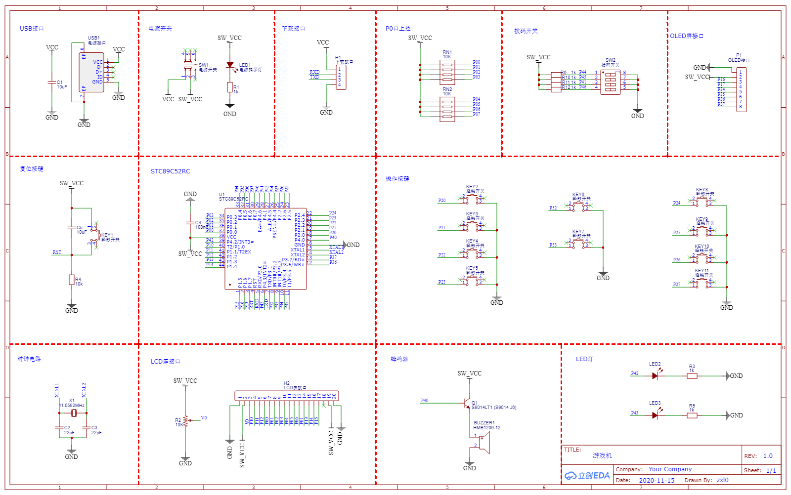
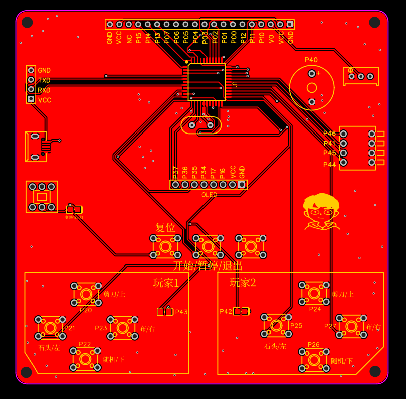

# **双人对战游戏机**

**主要元器件**

STC12C5A60S2

IIC接口的OLED屏

**游戏：**

1、石头剪刀布

2、贪吃蛇

3、乒乓球

**演示视频**

https://www.bilibili.com/video/BV1WT4y1M7bx

**规则：**

在首页两位玩家均可通过上下键选择游戏，确定/返回键进入游戏；在游戏界面可通过复位键或确定/返回键退回首页

**石头剪刀布：**每一局结束将显示各玩家的情况及结果，并记录得分，若有玩家得分达到3分则玩家取得最终胜利，自动退回首页。

**贪吃蛇：**180秒倒计时结束，通过比较双方得分确定胜负；若倒计时未结束，但有玩家撞到边界、自身、其他玩家，则直接判定另一玩家获胜。

**乒乓球：**由上下键控制挡板上下移动，将球挡回；若有玩家未将球挡回，则判定另一玩家获胜。

**正面图**

**背面图**

**原理图**

**PCB图**

**立创EDA工程：**

https://oshwhub.com/zxl0/shuang-ren-dui-zhan-zhi-neng-you-hu-ji

